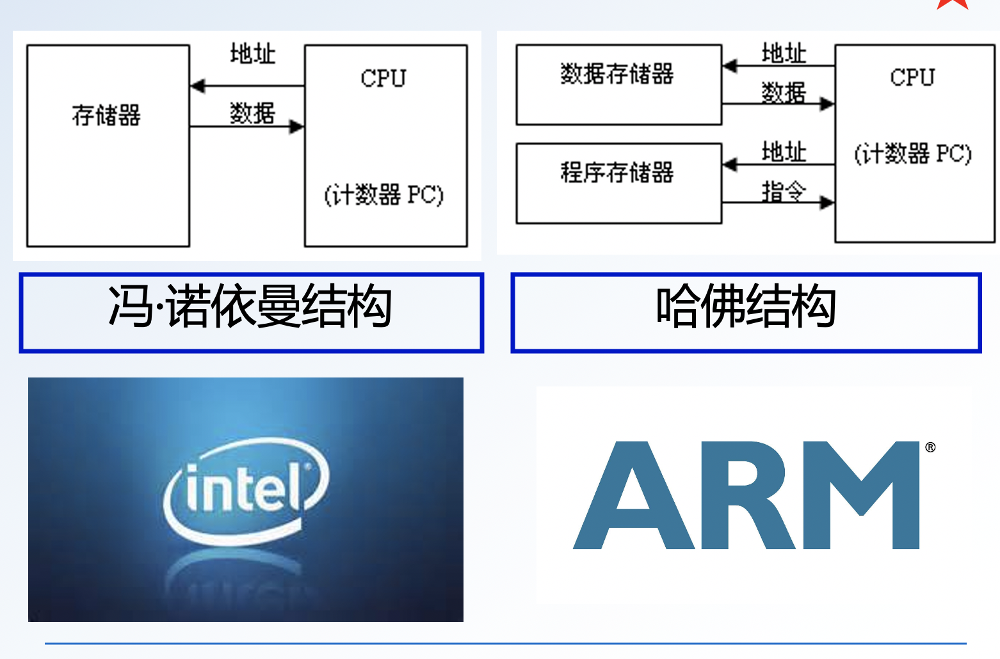
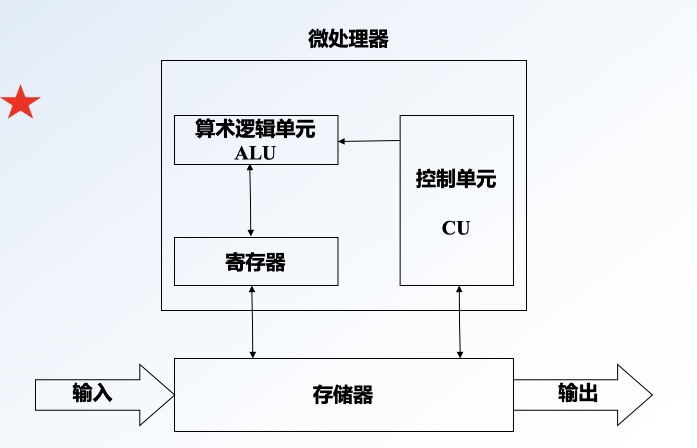
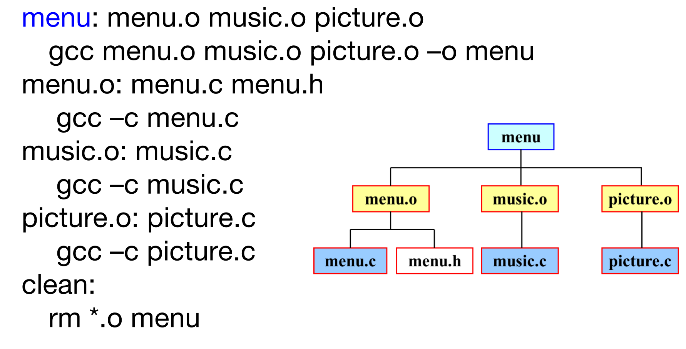
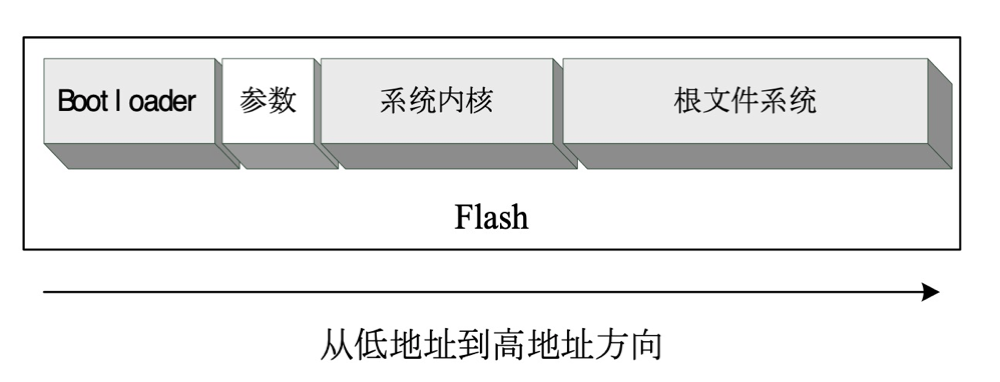
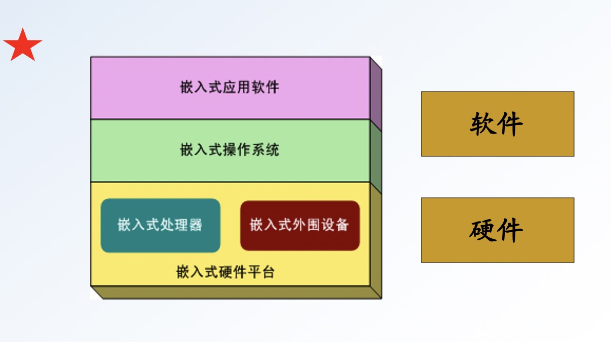

# 嵌入式系统重点


## 一、选择、填空、判断

## 1. 嵌入式系统的定义和特点

### 定义:

嵌入式系统是以**应用**为中心，以计算机技术为基础，**软硬件高度定制**，适用于对功能、可靠性、成本、体积、功耗有严格要求的**专用计算机系统**。

### 特点:

- 专用性
- 可剪裁
- 可靠性
- 实时性
- 低功耗

## 2. 嵌入式系统体系结构、存储设备的分类

### 结构:

- 硬件平台：处理器、外围设备
- 操作系统
- 应用软件

处理器：

- 微处理器
- 微控制器
- 数字信号处理器（DSP）
- SOC

外围设备包括：

- 显示
- 存储
- 通信

### 存储设备

 存储设备的分类：

- RAM
- ROM


## 3. 嵌入式软件的测试阶段和测试策略

#### 测试阶段

1. 单元或模块测试
2. 集成测试
3. 外部功能测试
4. 回归测试
5. 系统测试
6. 验收测试
7. 安装测试

#### 测试策略

* 单元测试——在主机环境上进行

* 集成测试——在主机环境上进行

* 系统测试和确认测试——在目标环境上进行

## 4. 嵌入式系统的应用

1．工业控制：

基于嵌入式芯片的工业自动化设备将获得长足的发展，目前已经有大量的8、16、32 位嵌入式微控制器在应用中，网络化是提高生产效率和产品质量、减少人力资源主要途径，如工业过程控制、数字机床、电力系统、电网安全、电网设备监测、石油化工系统。就传统的工业控制产品而言，低端型采用的往往是8位单片机。但是随着技术的发展，32位、64位的处理器逐渐成为工业控制设备的核心，在未来几年内必将获得长足的发展。

2．交通管理：

在车辆导航、流量控制、信息监测与汽车服务方面，嵌入式系统技术已经获得了广泛的应用，内嵌GPS模块，GSM模块的移动定位终端已经在各种运输行业获得了成功的使用。目前GPS设备已经从尖端产品进入了普通百姓的家庭，只需要几千元，就可以随时随地找到你的位置。

3．信息家电：

这成称为嵌入式系统最大的应用领域，冰箱、空调等的网络化、智能化将引领人们的生活步入一个崭新的空间。即使你不在家里，也可以通过电话线、网络进行远程控制。在这些设备中，嵌入式系统将大有用武之地。

4．家庭智能管理系统：

水、电、煤气表的远程自动抄表，安全防火、防盗系统，其中嵌有的专用控制芯片将代替传统的人工检查，并实现更高，更准确和更安全的性能。目前在服务领域，如远程点菜器等已经体现了嵌入式系统的优势。

5．POS网络及电子商务：

公共交通无接触智能卡(Contactless Smartcard, CSC)发行系统，公共电话卡发行系统，自动售货机，各种智能ATM终端将全面走入人们的生活，到时手持一卡就可以行遍天下。

6．环境工程与自然：

水文资料实时监测，防洪体系及水土质量监测、堤坝安全，地震监测网，实时气象信息网，水源和空气污染监测。在很多环境恶劣，地况复杂的地区，嵌入式系统将实现无人监测。

7．机器人：

嵌入式芯片的发展将使机器人在微型化，高智能方面优势更加明显，同时会大幅度降低机器人的价格，使其在工业领域和服务领域获得更广泛的应用。

## 5. **Flash**的分类

* NOR FLASH
* NAND FLASH

## 6. 嵌入式系统与通用计算机系统的区别

### 通用计算机 vs. 嵌入式计算机（专用）

通用计算机

巨型机、工作站、PC、笔记本计算机

技术要求是高速、海量的数值计算

技术发展方向是总线速度的无限提升，存储容量的无限扩大

### 嵌入式计算机

电动牙刷、打印机、数码相机、电视机，路由器、交换机

技术要求是对象的智能化控制能力

技术发展方向是低功耗、高可靠性与强控制能力

## 7. 嵌入式处理器的分类

* 微控制器（MCU）
* 微处理器（MPU）
* 数字信号处理器（DSP）
* 片上系统（SoC）

## 8.什么是 ARM ?

ARM (Advanced RISC machines) 先进精简指令及机器。是英国的一家微处理器行业的知名企业，该企业设计RISC (精简指令集) 处理器，只设计芯片，而不生产芯片。

## 9. 典型的嵌入式操作系统的特点

* 向上提供对用户的接口（如图形界面、库函数API等）

* 向下提供与硬件设备交互的接口（如硬件驱动程序等）

* 管理复杂的系统资源
* 同时，它还在系统实时性、硬件依赖性、软件固化性以及应用专用性等方面，具有更加鲜明的特点

## 10. 微处理器的重要指标

### 1

主频、倍频、外频

主频＝外频×倍频

### 2

缓存 

L1 Cache(一级缓存) ：数据缓存和指令缓存

L2 Cache(二级缓存)：分为内部和外部两种芯片

L3 Cache(三级缓存)：早期外置，现在都是内置的

## 11. 嵌入式微处理器的流水线技术

通常微处理器在处理一条指令要经过三个步骤：取指（从存储器装载一条指令）、译码（识别将要被执行的指令）、执行（处理指令并将结果写回寄存器）。流水线技术通过多个功能部件并行工作来缩短程序执行时间，提高微处理器的运行效率和吞吐率。

几个指令可以并行执行，提高处理器的运行效率

## 12. **ARM**精简指令集的体系结构特点

* 所有的指令都可根据前面的执行结果决定是否被执行，从而提高指令的执行效率

* 可用加载/存储指令**批量传输数据**，以提高数据的传输效率

* 可在一条数据处理指令中**同时完成逻辑处理和移位处理**

* 在循环处理中使用**地址的自动增减**来提高运行效率

## 13. 嵌入式存储系统中存储设备的分类（RAM、SRAM、DRAM、FLASH）

RAM:

- SRAM (static: 静态不刷新)
- DRAM (dynamic: 动态刷新，成本低)

SDRAM (Synchronous)：

SDR -- DDR -- DDR2 -- DDR3 -- DDR4

频率计算：

DDR200 MHz (100 * 2) -- PC1600 (100 * r * 2 * 8)

DDR内存带宽=时钟频率\*2\*内存位宽

## 14. NOR FLASH 和 NAND FLASH 的特点

ROM:

- NOR ROM
- NAND ROM

NOR:

| 指标     | NOR                                                          | NAND           |
| :------- | ----------| -------------- |
| 软件执行 | 直接执行                                                     | 无法直接执行   |
| 速度     | 读快写慢（写操作需要擦除和写入两个过程，每次查出只能擦除一个扇区，不能逐个擦除） | 读慢写快       |
| 芯片容量 | 小                                                           | 大             |
| 单元尺寸 | 大（扇区为单位）                                             | 小（块为单位） |
| 寿命     | 10万次                                                       | 100万次        |
| 平均价格 | 贵                                                           | 便宜           |

## 15. JTAG 结构功能

20、14、10pin

经常用简易JTAG接口直接烧写嵌入式系统Flash存储器

## 16. ARM 各版本功能

8个指令集版本：V1～V8

废弃的：V1(26bit), V2(26bit), V3(32bit)

* V4: 支持半字加载, 16位Thumb指令集，特权方式 ARM7

V5: 增加了V4的指令，增强型DSP指令集，支持JAVA ARM9

V6: 注重低功耗，强化了图形、视频、音频处理能力 ARM11

V8: 是一个真正意义上的64位，同时这个64位的架构当中加入了32位的支持。

## 17. ARM 指令和 Thumb 指令的特点和区别

|     方面     |         差异         |                             原因                             |
| :----------: | :------------------: | :----------------------------------------------------------: |
|   存储空间   | Thumb是ARM的60%至70% | 因为Thumb的指令集是16位的，而RAM的指令集是32位的。Thumb指令集要短一半。 |
|    指令数    | Thumb比ARM多30%至40% | 因为Thumb是更加精简的指令集，指令的信息量小，同样的目标需要更多条指令 |
| 速度（32位） |   Thumb比ARM慢40%    | 因为Thumb指令的长度是16位，而ARM指令的长度是32位，所以在32位的处理器上后者的速度更快 |
| 速度（16位） | ARM比Thumb快40%~50%  | 在16位的处理器上每取一条32位的ARM指令需要两个周期，而对于Thumb只需要一个周期。 |
|  存储器功耗  |  Thumb比ARM低约30%   |  因为Thumb的指令长度是ARM的一般，所以存储器存取的压力更小。  |

## 18. 哈佛总线结构和冯**·**诺依曼结构各自的特点， 记住图

### CPU



### 体系结构



## 19. 从应用上讲，**Linux**的主要组成部分( 即 **Linux**的基本操作系统结构)

- 内核
- shell
- 文件系统
- 实用工具

Android是基于Linux内核的移动操作系统，自下而上分四层，依次为:内核层，系统库，框架层及应用层。

## 20. Linux 文件系统目录存放的内容

## 21. Linux 启动是，第一个必须挂载的是根文件系统

## 22. MTD 的功能

Memory Technology Device，存储技术设备

MTD是Flash的一种管理方法，将Flash划分成几个分区，便于管理。

**MTD的作用**

+ 对Flash构建了分区表，从而能够启动linux系统
+ nand命令可以使用宏参数，例如“nand read.jffs2 0x30007FC0 kernel;”命令中的kernel，kernel参数代表了内核分区的加载地址和大小。

## 23. 基于FLASH 的文件系统类型，基于RAM的文件系统类型

### FLASH

* JFFS2
* YAFFS
* Cramfs

### RAM

* Ramdisk
* Ramfs/tmpfs

## 24. “**[root@BC root]#”**中各符号的含义

- root： 用户名
- BC：主机名
- root：路径
- \#：提示符

## 25. Linux 常用命令及练习题

## 26. **Vi**的模式

* 命令行模式
* 插入模式
* 底行模式

## 27. **GCC**的基本用法

四个阶段：

* 预处理：-E .i
* 编译： -S .s
* 汇编： -c .o
* 连接：a.out

## 28. **GDB**本地调试的命令

* 首先  `gcc -g main.c` 编译
* gdb a.out
* file a.out #加载文件
* list <linenum/function> #显示代码
* break <linenum/function> 
* delete <breakpoint/range>
* run (r)
* continue (c)
* step (s)
* next (n) #nextline
* finish (f) # 跳出函数
* print #打印
* quit (q)

## 29. 基本**Makefile**结构

```makefile
target :  dependency_files    #依赖关系
<TAB>  command              #命令
```



## 30. **Make**工具的使用

直接使用 `make` 命令，会默认指向第一个目标文件。

按照`GNUmakefile`,`makefile`,`Makefile`顺序搜索 makefile

也可以指定Makefile

```bash
make -f filename
```

## 31. **Makefile**变量

###     递归展开方式（引用赋值）

```makefile
a = origional_value
b = $(a)
a = later_value
# 现在 a=later_value
```

### 简单扩展方式（值传递）

```makefile
a = origional_value
b := $(a)
a = later_value
# 现在 a=origional_value
```

## 32. **Makefile**规则

* 隐式规则
* 模式规则

## 33. **Makefile**应用和注意事项

### 小结

* 如果make命令行中没有指定目标，则系统默认target指向描述文件中第一个目标文件（即第一个用：标志的对象）
* 按照依赖文件依次执行相应的命令
* 没有依赖关系的目标文件不被编译
* 变量的定义最好放在开始处 
* .h文件可以不出现在依赖文件列表中
* make clean命令中如果不加文件名，默认的Makefile文件是GNUmakefile、makefile、Makefile。
* 当程序的规模较大时，文件依赖列表就会变得很长，或者命令的参数很多时，命令行很长，这时可采用分行的做法。

## 34. 实验用ARM目标板采用的编译器(armv4l- unknown-linux-gcc)

## 35. 嵌入式Linux开发流程

1. 建立宿主机开发环境
2. 配置宿主机
3. 建立引导装载程序BootLoader
4. 下载别人已经移植好的Linux操作系统
5. 建立根文件系统
6. 建立应用程序的Flash分区
7. 开发应用程序
8. 烧写内核、根文件系统、应用程序
9. 发布产品

## 36. 串行通信软件的配置和网络配置mount

## 37. 交叉编译

* 所谓交叉编译就是在一个平台上生成可以在另一个平台上执行的代码。
* 编译最主要的工作是将程序转化成运行该程序的CPU所能识别的机器代码
* 交叉编译就是在特殊的编译环境下，如同翻译一样，把程序代码编译成不同的CPU所对应的机器代码。
* 交叉编译环境建立在宿主机（一台普通计算机）上，对应的嵌入式开发板叫做目标板（或开发板）。

## 38. minicom和Windows XP超级终端的特点和使用注意事项

* 若系统时 *Linux*，则只能使用minicom
* 若使用Windows和虚拟机的情况，minicom和windowsXP超级终端都可以使用。但是启动了minicom之后超级终端不可用，需要重新启动系统。

## 39. NFS服务、Samba服务的基本概念和配置方法

### NFS（network file system）

指网络文件系统。可以使网络上**同为Linux或UNIX的操作系统通信。**

```bash
mount  -t  nfs 　-o nolock　192.168.123.118:/arm2410s  /mnt	
```

### Samba

可以实现 Windows 和 Linux 不同系统之间的文件共享。 

## 40. NFS 服务实现的原理及注意事项

* NFS(Network File System)是一项在不同机器、不同操作系统之间通过网络共享文件的技术
* 通过NFS可以让计算机通过网络将NFS服务器共享出来的文件安装到自己的系统中。

## 41. 将宿主机NFS服务所共享的目录/arm2410s挂载到开发板的/mnt目录命令

```bash
mount  -t  nfs 　-o nolock　192.168.123.118:/arm2410s  /mnt	
```

## 42. NFS服务和 Samba 服务的区别

Samba自然主要用于在Windows和Unix之间共享资源。资源包括文件、打印机等等。

NFS主要用于Unix，Linux系统，基于TCP/IP协议层，可以将远程的计算机磁盘挂载到本地，像本地磁盘一样操作。

## 43. BootLoader的基本概念

启动加载程序

是系统加点后运行的第一段代码，是在操作系统内核运行前运行的一段小程序。

功能：

* 初始化硬件设备（CPU的主频、SDRAM、中断、串口等）
* 内核启动参数
* 启动内核
* 与知己交互，从串口，USB或者网口下载映像文件，并可以对Flash等存储设备进行管理

## 44. 一个嵌入式Linux系统从软件的角度看，分为四个层次

* BootLoader、（驱动程序）
* Linux内核
* 根文件系统
* 用户应用程序

## 45. BootLoader特点、安装媒介

### 特点：

* 严重依赖于硬件，每种不同的CPU体系结构都有不同的 BootLoader
* BootLoader 还依赖具体的嵌入式版及配置

### 安装媒介：？？

* 系统加电或复位后，所有的处理器通常都从某个预先安排的地址上取指令。比如，ARM在复位时从地址 0x0 取指

* 嵌入式系统通常都有某种类的固态存储设备被映射到这个预先安排地址上。因此在系统加电后，处理器将首先执行BootLoader 程序
* BootLoader 是最先被系统执行的程序

## 46. 固态存储设备的典型空间分配结构




## 47. BootLoader的操作模式，哪种面向用户?哪种用于烧写 内核 和根文件系统?

用户：启动加载模式

烧写：下载

## 48. BootLoader与主机之间的通信设备及协议

串口：

* xmodem
* ymodem
* zmodem

以太网口：

TFTP

## 49. 几种流行的Linux BootLoader

* U-Boot
* BLOB
* RedBoot
* VIVI

## 50. vivi下载模式的进入方法

`load`命令 

## 51. 对FLASH分区后为什么要重新烧写ViVi

* 由于对flash进行了重新分区，利用VIVI重新对Flash分区后，原来烧写在flash中从地址0处的引导加载程序vivi也被擦除了。
* 原来烧写到Flash中的VIVI程序已经丢失，但是此时VIVI已经在内存中运行，所以千万不要重新启动开发板，利用此时的VIVI下载模式，可以通过串口重新烧写VIVI程序。

## 52. 使用串口下载文件到Flash的一般命令

vivi

+ `load`命令

U-Boot

+ `loads` / `loadb` / `loady`命令

## 53. MMU的全称和含义

全称：内存（存储）管理单元

功能：完成虚拟空间到物理空间的映射，控制访问权限


## 54. 一台内存为256MB的32bit X86主机，其虚拟地址空间范围是什么，物理地址空间范围是什么

### 虚拟

$0 - 2^{32}$

### 物理

$0-2^{28}$


## 55. 操作系统内核的复杂性相当程度上来自于什么

内存管理

## 56. MMU的作用

* 实现虚拟地址到物理地址映射
* 实现对地址访问的保护和限制

## 57. ARM-Linux的内存管理机制的两种模式

* 分段：按段进行管理，段的大小为1MB
* 分页：按照两层的页式管理方式管理，页的大小可以64KB（大页面）或4KB（小页面）

## 58. 32位ARM微处理器的内核空间和用户空间的划分

* 内核空间（高端的1GB）
* 用户空间（低端的3GB）

## 59. Linux系统启动时，使用什么将内核映像载入

BootLoader (stage2)

## 60. Linux的模块基本概念及相应的命令

* Linux 中的可加载模块（module）是 Linux 内核支持的动态加载模块，它们是内核的一部分，但是并没有编译到内核中。
* 模块可以单独编译成目标代码，以 .o 的形式存在。它可以再需要启动后动态加载到系统内核中。当模块不再被需要时，可以动态地卸载出系统内核。
* Linux 中大多数设备驱动程序或文件系统都是以模块形式存在
* 超级用户可以通过 `insmod` 和`rmmod` 命令显示地将模块载入和卸载。内核也可以在需要时，请求内核守护进程装载和卸载模块。
* 由于模块技术使用内核更加模块化，因而成为一种增加内容到内核的较好方式，许多常用的设备驱动程序就做成模块。

### 命令

| 命令   | 功能                |
| ------ | ------------------- |
| lsmod  | 列出已安装的 module |
| insmod | 安装模块            |
| rmmod  | 卸载模块            |
| depmod | 创建依赖文件        |

## 61. 内核裁剪配置方法中最稳定、使用最广泛的方法

```bash
make menuconfig
```
## 62. Busybox的功能

BusyBox用来精简基本用户命令和程序，它将数以百计的常用Linux命令集成到一个可执行文件中（名为BusyBox），所占用的空间只有1MB左右

## 63. 进程和线程的概念

* 包含关系
* 地址空间
* 独立性

任务 -- (至少有一个)-- 进程 --( 至少有一个)-- 线程
进程：是一个程序的冬天执行，有独立的代码和数据空间，是资源分配的最小单位。线程之间具有独立性，崩溃后不会影响。
线程：不具备独立的地址空间，共享地址空间，线程奔溃后进程也会崩溃。

## 64. 进程间通信

在 Linux 操作系统支持下编写应用程序时，无论是操作系统与用户进程之间，还是用户进程之间，经常需要共享数据和交换信息，这一过程称之为 进程间的通信。

## 65. 进程间的通信方式

* 信号
* 管道
* 消息队列
* 共享内存
* 信号量
* 套接字

## 66. **系统调用**是操作系统内核和应用程序之间的接口

## 67. **设备驱动程序**是操作系统内核和机器硬件之间的接口

## 68. Linux系统的设备分类

* 字符设备
* 块设备
* 网络设备

## 69. 设备号及其分类

* 主设备号：对应一类设备，将设备与相应的驱动程序对应起来
* 次设备号：对应具体设备

## 70. 设备进入点的创建、查看和删除命令

| 命令  | 功能 | 举例                                       |
| ----- | ---- | ------------------------------------------ |
| mknod | 创建 | **mknod** **/dev/****demo_drv** **c 98 0** |
| ls    |      |                                            |
| rm    |      |                                            |


## 71. 设备驱动程序加载、查看和卸载命令

| 命令                    | 功能         |
| ----------------------- | ------------ |
| insmod <设备驱动程序.o> | 加载         |
| lsmod                   | 查看模块     |
| rmmod <设备驱动程序>    | 删除驱动模块 |

## 72.  设备文件的存放位置、file_operations结构体

/dev/

## 73. 设备驱动程序和用户应用程序的区别

* 应用程序一般有一个main 函数，从头到尾执行一个任务；驱动程序却不同，它没有main 函数，通过使用宏module_init(初始化函数名)，将初始化函数加入内核全局初始化函数列表中。通过宏module_exit(退出处理函数名)注册退出处理函数

* 应用程序可以包含标准的头文件，比如<stdio.h>、<stdlib.h>等；在驱动程序中是不能使用标准C 库的，因此不能调用所有的C 库函数， 只能调用内核的函数，比如输出打印函数只能使用内核的printk 函数，包含的头文件只能是内核的头文件<linux/kernel.h>

## 74. 嵌入式GUI的特点

* 轻型
* 占用资源少
* 性能高
* 高可靠
* 可配置

## 75. Qt的两个支撑工具

* qmake
* Qt designer

## 76. Qt的基本概念及主要的类(3个)

Qt 是挪威Trolltech公司出品的一个跨平台的C++图形用户界面库。

* QObject
* QApplication
* QWidget

### 设计流程

* 创建和初始化子部件
* 设置子部件布局
* 设置Tab键次序（不是必须）
* 建立信号与插槽的连接
* 编写事件处理函数

## 77. 信号和插槽的基本概念、机制和连接

信号和插槽是Qt自行定义的一种通信机制，它独立于标准的C/C++语言，因此要正确地处理信号和插槽，必须借助于一个称为moc（Meta Object Compiler）的Qt工具。

信号和插槽机制是一种强有力的对象间通信机制。

当对象改变状态时，信号就由该对象发射（emit）出去了，这就是对象所要做的全部工作，它不知道另一端是谁在接收这个信号。这就是真正的信息封装。

插槽用于接收信号，但它们是普通的对象成员函数。一个插槽并不知道是否有任何信号与自己相连接。而且，对象并不了解具体的通信机制

所有从QObject或其子类（例如QWidget）派生的类都能包含信号和插槽。

## 78. 声明信号的关键字，信号的特点

* singals
* emit


* 从形式上讲信号的声明与普通的C++函数是一样的，但是信号却没有函数体定义。
* 信号的返回类型都是void
* 信号是由moc自动产生，它们不应该在.cpp文件中实现

## 79. 包含signal和slot的类需要的关键字

在类内加入关键字：
Q_OBJECT

声明关键字：
signals
slots

## 80. 嵌入式数据库的特点

* 体积小，嵌入式数据库编译后的产品不过几十千字节。
* 可靠性，应该可以预知嵌入式数据库的操作、系统的大小、性能
* 提供功能定制，可以根据其具体应用的环境来定制数据库的系统功能
* 支持SQL查询语言，提供数据库及数据表的管理功能
* 提供接口函数，以供在高级语言中调用
* 实时性
* 有一定的底层控制能力

## 81. SQLite最大特点

无数据类型

## 82. SQLite3的命令

Linux安装软件的步骤：
* 解压sqlite-3.5.9.tar.gz
* 配置
* 编译并安装
* 验证

| 命令（第二行开始需要在前面加 ' . ' ） | 功能                           |
| ------------------------------------- | ------------------------------ |
| sqlite3 <数据库名>                    | 创建数据库                     |
| tables                                | 查看当前数据库中有所少个数据表 |
| schema                                | 查看表结构                     |
| database                              | 查看当前数据库                 |
| output <文件名>                       | 把查询结果输出到文件           |
| dump <表明>                           | 输出表结构，同时输出操作记录   |
| help                                  | 查看帮助                       |
| quet/exit                             | 退出                           |


## 83. 含有SQLite3的API函数的应用程序，在编译时需要加上的参数

-lsqlite3

## 84. SQLite的驱动程序是什么?

**QSQLITE**

## 85. Qt 提供的三种SQL模型

* QSqlQueryModel
* QSqlTableModel
* QSqlRelationModel

## 86. Qt4要实现与数据库的连接需用到的类

**QSqlDatabase** 类

## 87. 客户端与服务端的连接过程

三次握手

## 88. IP地址与端口号的定义

IP：网络层地址，用于区分网络中的主机

端口号：传输层地址，用于区分主机中的进程

## 89. TCP与UDP协议

### TCP

传输控制协议：是面向连接的通信协议。

### UDP

用户数据报协议：无连接通信协议。

## 90. 套接字、套接字类型

IP:端口，即 IP 与端口的组合

* 字节流套接字
* 数据报套接字
* 原始套接字

## 91. Socket网络函数所需的头文件

```c
#include <sys/types.h>
#include <socket.h>
```
## 92. send和 recv函数

用于 TCP

## 93. sendto和recvfrom函数

用于UDP

## 简答

## 1. 嵌入式系统中的存储设备Flash的分类，各类的特点

| 指标     | NOR                                                          | NAND           |
| :------- | ----------| -------------- |
| 软件执行 | 直接执行                                                     | 无法直接执行   |
| 速度     | 读快写慢（写操作需要擦除和写入两个过程，每次查出只能擦除一个扇区，不能逐个擦除） | 读慢写快       |
| 芯片容量 | 小                                                           | 大             |
| 单元尺寸 | 大（扇区为单位）                                             | 小（块为单位） |
| 寿命     | 10万次                                                       | 100万次        |
| 平均价格 | 贵                                                           | 便宜           |

## 2. 嵌入式系统的概念及组成结构（图）


## 3. 嵌入式系统的应用

电动牙刷、打印机、数码相机、电视机，路由器、交换机

## 4. ARM最小系统的组成，核心板的定义

### 微处理器单元

* ARM  微处理器
* 电源电路
* 复位电路
* 晶振电路

### 存储单元

* SDRAM
* Flash

### 接口单元

* UART 接口电路（与外界通信）
* JTAG调试接口（系统软件的下载和烧写）

由最小系统组成的电路开发板称为**核心板**

## 5. ARM的设计思想

ARM微处理器被设计成较小的核，**降低功耗**，延长电源的使用时间。

完善存储管理，采用32/16位指令集，这就要求嵌入式系统需要使用高密度代码。

嵌入式系统对**成本敏感**，一般选用速度不高，成本较低的存储器，以降低系统成本。

ARM内核不是一个纯粹的RISC体系结构，这是为使他能够更好地**兼容**其他嵌入式的应用领域。

## 6. 哈佛总线结构和冯·诺依曼结构图

## 7. Linux常用操作命令的使用（文件目录相关命令、mount、网络相关命令ping、ifconfig）、文件属性（文件权限）


## 8. GDB远程调试的步骤和命令

1. 启动程序，并可以指定某些参数控制程序的运行
2. 可以让被调试的程序在用户所指定的断点处停住
3. 当程序停止时，检查程序的状态
4. 动态地改变程序的参数，可以避过bug，继续查找其他的问题。

## 9. GCC的执行过程

* 预编译
* 编译
* 汇编
* 连接

## 10. Makefile文件的编写及依赖关系图

## 11. Makefile规则

```makefile
target: dependency_files
<TAB> command
```
## 12. 嵌入式Linux开发流程

1. 建立宿主机开发环境
2. 配置宿主机
3. 建立引导装载程序 BootLoader
4. 下载别人已经移植好的 Linux 操作系统
5. 建立根文件系统
6. 建立应用程序的 Flash 分区
7. 开发应用程序
8. 烧写内核，根文件系统，应用程序
9. 发布产品

## 13. 将文件(内核)移植到开发板执行的步骤

1. **下载**别人已经移植好的 Linux 操作系统
2. 下载后根据自己的系统要求进行**裁剪、配置**，再**添加**自己的特定硬件的**驱动程序**，进行**调试修改**，最终得到一个适合于自己平台的内核。
3. 将其进行**交叉编译**，就可以得到符合要求的**内核映像文件**
4. 最后将其下载到 Flash 存储器芯片的相应**分区**中运行

## 14. BootLoader的典型结构框架（启动流程），各阶段（stage1和stage2）的工作过程

### 启动流程（两部分）：

* stage1
* stage2

### stage1:

1. 硬件设备初始化
2. 为加载 BootLoader 的 stage2 准备 RAM 空间
3. 拷贝 BootLoader 的 stage2 到 RAM 空间中
4. 设置好堆栈
5. 跳转到 stage2 的 C 入口点

### stage2:

1. 初始化本阶段要使用到的硬件设备
2. 检测系统内存映射
3. 将内核映像和根文件系统从 Flash 上读到 RAM 空间中
4. 为内核设置启动参数
5. 调用内核

## 15. BootLoader的功能

1. 硬件设备初始化（CPU主频、SDRAM中断、串口等）
2. 内核启动参数
3. 启动内核
4. 与主机进行交互，从串口、USB口或者网络口下载映像文件，并对Flash等存储设备进行管理

## 16. 在vivi>提示符下用命令bon part对Flash进行分区，原理及分区图

```bash
bon part 0 192k 1M
```



## 17. MMU的主要作用

MMU 主要用来管理虚拟存储器、物理存储器的控制线路，同时也负责虚拟地址映射为物理地址，以及提供硬件机制的内存访问授权、多任务多进程操作系统。

## 18. Linux模块化的特点

* 使内核配置更加灵活
* 应用模块技术会对系统的性能和内存有一定的影响，降低了内核资源的访问效率
* 它与其他内核代码的地位是相同的

## 19. 任务、进程、线程的概念及关系


## 20. 进程间通信的目的

* 数据传输
* 共享数据
* 通知事件
* 进程控制

## 21. 主要进程间的通信方式

* 信号
* 管道
* 消息队列
* 共享内存
* 信号量
* 套接字

## 22. Fork函数

## 23. 父进程、子进程的执行与原理

创建子进程。当进程A调用fork()函数创建子进程B时，如果创 建成功，同时在A和B两个进程中返回。父进程A中的fork() 函数返回的是子进程的进程号，子进程B的fork()函数返回 的是0

## 24. exec函数的使用


## 25. 线程创建过程和线程的并发机制

```c
pthread_create
```


## 26. 互斥锁的使用

## 27. 设备驱动程序完成的功能

* 对设备初始化和释放；驱动程序要完成设备注册、初始化、及对设备的卸载
* 数据传送；驱动程序在内核、硬件和应用程序之间传送数据。
  * 把数据从内核传送到硬件和从硬件读取数据；
  * 读取应用程序传送给设备文件的数据和回送应用程序请求的数据；
*   检测和处理设备出现的错误

## 28. Linux设备驱动程序原理

* 用户进程运行在用户空间，设备驱动程序工作在内核 空间
* 系统调用是用户进程进入内核空间的唯一通道。
* 每当用户进程使用系统调用时，都自动地将运行模式 从用户级转为内核级，此时进程在内核的地址空间中 运行。
* Linux抽象了对硬件的处理，各种设备都以文件的形 式存放在/dev目录下，称为设备文件。
* 所有的硬件设备都可以作为普通文件来看待，应用程 序可以打开、关闭和读写这些设备文件，完成对设备 的操作，就像操作普通的数据文件一样

## 29. 设备驱动程序和用户应用程序的区别

* 应用程序一般有一个main 函数，从头到尾执行一个任务；驱动程序却不同，它没有main 函数，通过使用宏module_init(初始化函数名)，将初始化函数加入内核全局初始化函数列表中。通过宏module_exit(退出处理函数名)注册退出处理函数

* 应用程序可以包含标准的头文件，比如<stdio.h>、<stdlib.h>等；在驱动程序中是不能使用标准C 库的，因此不能调用所有的C 库函数， 只能调用内核的函数，比如输出打印函数只能使用内核的printk 函数，包含的头文件只能是内核的头文件<linux/kernel.h>

## 30. 一个设备驱动程序的基本框架


## 31. Signal和Slot的连接方式

emit

connect

## 32. SQLite3中常用API函数的使用


| 功能         | 函数 |
| :--- | :--- |
| 打开数据库 | sqlite3_open |
| 关闭数据库 | sqlite3_close |
| 执行函数 | sqlite3_exec |
| 释放内存函数 | sqlite3_free |
| 显示错误信息 | sqlite3_errmsg |
| 获取结果集 | sqlite3_get_table |
| 释放结果集 | sqlite3_free_table |
| 声明SQL语句 | sqlite3_prepare |
| 销毁SQL语句 | sqlite3_finalize |
| 重置SQL声明 | sqlite3_reset |


## 33. 用“端口号”来标识进程

## 34. 利用Socket方式进行数据通信与传输的程序流程

1. 创建服务端socket，绑定建立连接的端口。
2. 服务端程序在一个端口处于阻塞状态，等待客户机 的连接。
3. 创建客户端socket对象，绑定主机名称或IP地址， 指定连接端口号。
4. 客户机Socket发起连接请求。
5. 建立连接。
6. 利用send/sendto和recv/recvfrom进行数据传输。
7. 关闭socket。
